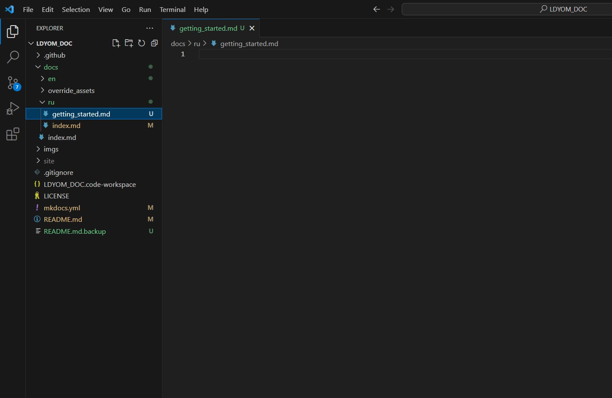
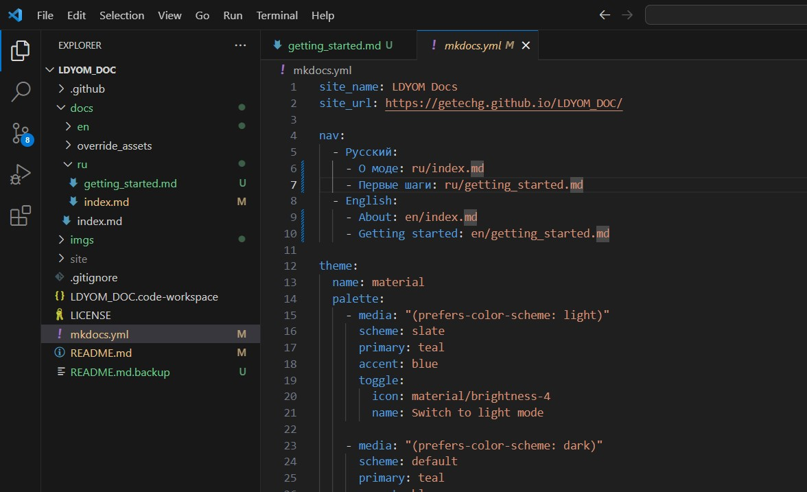
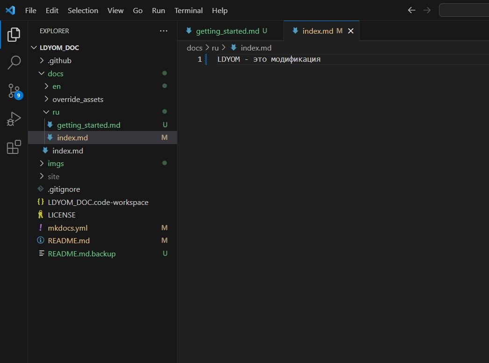
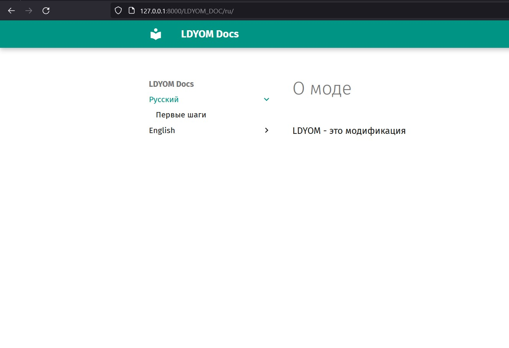

## Installation

### 1. Install Python 3.8

Make sure you have Python version 3.8 or higher installed. You can download it from the [official Python website](https://www.python.org/downloads/).

### 2. Install MkDocs and Material Theme

Open the Command Prompt and execute the following commands:

```sh
pip install mkdocs
pip install mkdocs-material
```

## Usage

### Launching the Local Server

For a preview, run:

```sh
mkdocs serve
```

Open a web browser and go to [http://127.0.0.1:8000/](http://127.0.0.1:8000/) to view the results.

### Documentation Structure

All documentation is organized within the `docs` folder. Inside this folder, you'll find subfolders with names corresponding to different languages (e.g., `ru`, `en`, etc.). The root folder contains the `mkdocs.yml` file, where the main documentation settings are specified.

For more detailed settings, refer to the [official MkDocs website](https://www.mkdocs.org/). However, for basic documentation editing, you only need the `nav` section. In this section, you define the documentation structure. In other words, if you want to create a new documentation page, create a file in the format `docs/<language>/<subsection>/my_file.md`.



Then, in the `nav` section of the `mkdocs.yml` file, specify the path to the new page relative to the `docs` folder, following the required structure.



Additionally, you can create an `index.md` file inside a subfolder to automatically generate a page for that subsection. This simplifies navigation through the documentation and makes it more structured.



### Markdown Styling Guide

If you are interested in how to format text in Markdown using various styles such as bold, italics, headers, etc., I recommend reading the detailed styling guide. You can find it [here](https://abl3t0nnile.github.io/docs/library/markdown/syntax_guide/).

This guide provides detailed instructions on applying various styles in Markdown, making your text more readable and structured. From using bold and italics to creating headers and lists, you'll find everything you need for effective formatting of your documents. Follow the link to gain a deeper understanding of Markdown syntax and style application.

## Deployment on GitHub Pages

To deploy the documentation on GitHub Pages, run:

```sh
mkdocs gh-deploy --force
```